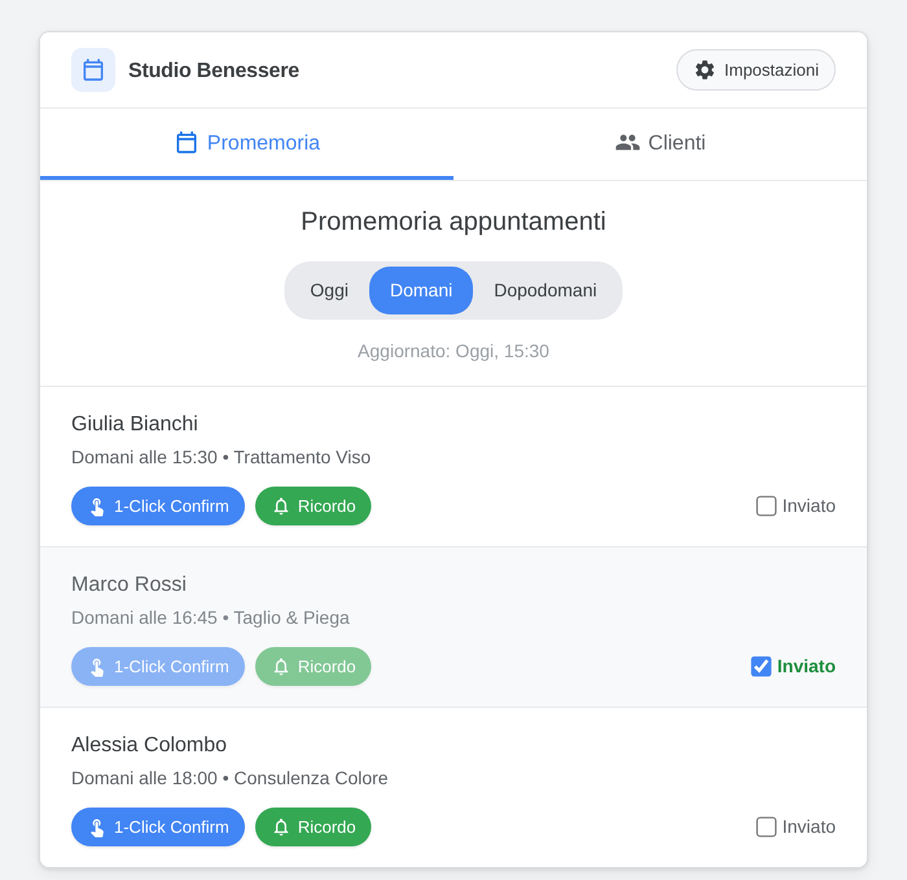
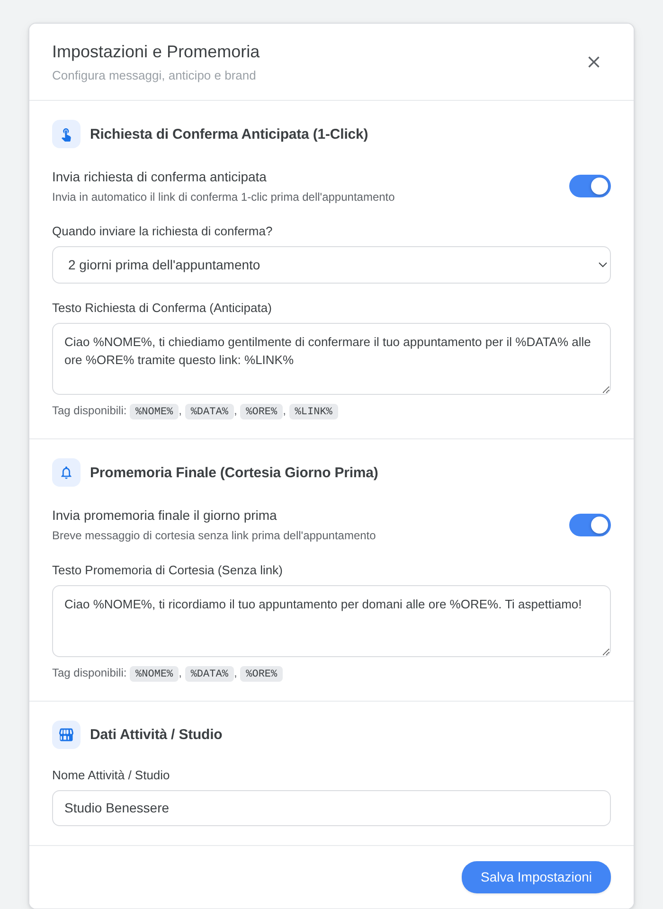
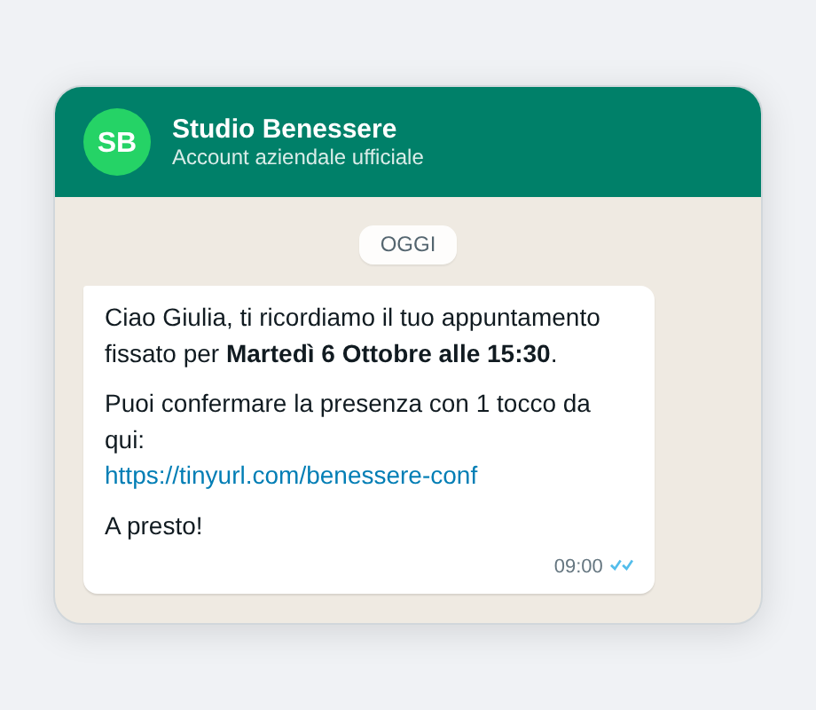
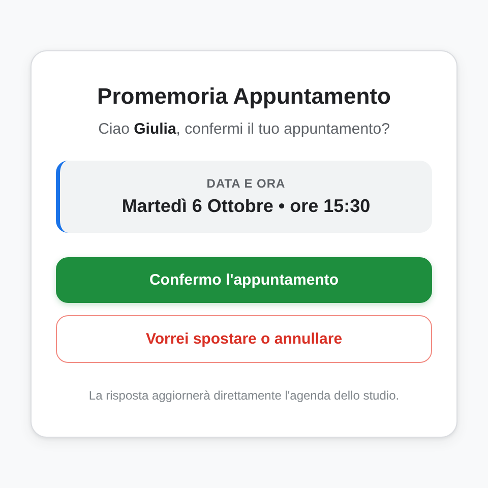
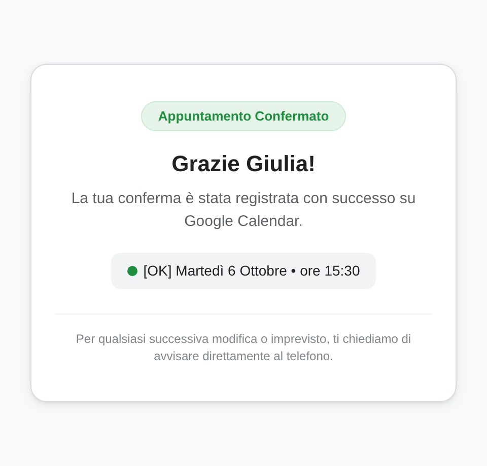
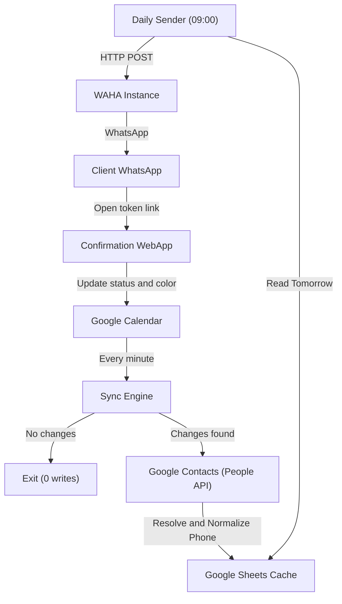

# waha-calendar-reminder

[](https://developers.google.com/apps-script)
[](https://workspace.google.com/products/calendar/)
[](https://contacts.google.com/)
[](https://workspace.google.com/products/sheets/)
[](https://waha.devlike.pro/)
[](tests/apps-script)
[](LICENSE)

A Google Apps Script automation that connects **Google Calendar**, **Google Contacts**, and **Google Sheets** to a self-hosted [WAHA](https://waha.devlike.pro/) (WhatsApp HTTP API) instance.

It sends automated appointment reminders via WhatsApp with interactive 1-click confirmation pages that update your Google Calendar in real time.

**Key workflow advantage: Zero calendar clutter.**  
Unlike tools that force you to type phone numbers into event titles (e.g. `Appointment Mario Rossi +39347...`), you just write the client's name. The system automatically resolves, normalizes, and verifies their phone number from your **Google Contacts** address book.

---

## Screenshots

### Operator Dashboard
<p align="center">
  
</p>

### Settings & Reminder Configuration
<p align="center">
  
</p>

### Client Experience (WhatsApp & 1-Click Confirmation)
<p align="center">
  
  
  
</p>

---

## How It Works

1. **Calendar Polling & Diff Detection:**
   A time-driven trigger runs every minute. It checks upcoming events (today + 3 days) against a spreadsheet cache. If nothing changed, it exits immediately without making any spreadsheet write calls, staying well within Google's daily script quotas.
2. **Contact Lookup (Google People API):**
   When new appointments are detected, phone numbers are retrieved from Google Contacts. The matching logic handles reversed names (e.g. `Rossi Mario` vs `Mario Rossi`), accent variations, and flags homonyms instead of guessing numbers.
3. **Automated Sending (WAHA):**
   A scheduled morning trigger (default: 09:00) queries upcoming appointments and sends WhatsApp reminders through your WAHA HTTP endpoint.
4. **1-Click Confirmation:**
   Messages can include a unique tokenized link. When opened, the client sees their appointment details with two actions:
   - **Confirm:** Event title receives an `[OK]` prefix and changes to green.
   - **Reschedule / Cancel:** Event title receives a `[SPOSTARE]` prefix and changes to red.
   Once submitted, the link locks into a read-only state to prevent conflicting re-submissions.



---

## Smart Contact Resolution (Google People API)

Most reminder tools force you to type phone numbers directly into calendar titles or descriptions (e.g. `Appointment Mario Rossi +393471234567`).

This project integrates directly with your **Google Contacts** address book via Google People API to keep your calendar natural and uncluttered:

- **Clean calendar titles:** Simply create events with the client's name (e.g. `Mario Rossi` or `Mario Rossi (colore + taglio)`). Configured service keywords are stripped automatically.
- **Order and accent tolerance:** Matches names regardless of ordering (`Rossi Mario` matches `Mario Rossi`), case, or accent variations (`José` matches `Jose`).
- **Anti-homonym protection:** If your contacts contain multiple people with the same name and different numbers, the system **never guesses**. It flags the appointment as ambiguous for operator review to prevent sending reminders to the wrong client.
- **Automatic phone normalization:** Cleans formatting (spaces, dashes, brackets, leading zeros) and prepends the correct international country code (`COUNTRY_CODE`, default: `39`).
- **Continuous background backfill:** If you create an appointment before saving the client's number, the engine flags it and retries at configured intervals (`PHONE_RETRY_MINUTES`). As soon as you add the contact on your smartphone, the next sync cycle picks up the number and updates the sheets automatically.

---

## Key Features

- **Google Contacts address book sync:** Zero manual copy-pasting of phone numbers. Matches contacts intelligently from your phone's address book.
- **Quota-friendly sync:** Uses in-memory state comparison before touching Google Sheets. Free Google accounts (`@gmail.com`) stay comfortably under the 90-minute daily execution limit.
- **Interactive client confirmation:** Clients do not need to reply with text or have a Google account. Tapping the link directly updates the operator's calendar.
- **Anti-replay locking:** Tokens are single-use. Once an appointment is confirmed or flagged, the page informs the client that changes require calling directly.
- **Privacy & security:** The web app strictly separates client confirmation views (`?c=<token>`) from the operator dashboard. Anonymous visits to the dashboard root return an access denied page unless authenticated as the owner account or using an optional admin secret.
- **Operational alerts via Gotify:** Optional notifications for consecutive sync errors, high quota consumption (>80%), or appointments missing phone numbers.
- **Comprehensive test suite:** 146 unit and integration tests written with Node's native test runner (`node:test`), mocking Google Apps Script services (SpreadsheetApp, CalendarApp, CacheService, PropertiesService, People API).

---

## Requirements

- A Google account (personal or Google Workspace).
- A Google Spreadsheet with the required sheet tabs.
- A running [WAHA](https://waha.devlike.pro/) instance (Docker / VPS).
- Node.js >= 18 (for local development, running tests, or using clasp).
- Google clasp CLI: `npm install -g @google/clasp`

---

## Setup Guide

### 1. Create the Google Spreadsheet

Create a Google Spreadsheet with the following 4 tabs.

> **Note on languages and column headers:** The script reads spreadsheet data strictly by column position (Column A, B, C...) and skips the header row. You can write your column headers in English, Italian, or any preferred language as long as the column order is preserved.

**Tab: `Clienti`** (Clients directory)
- Column A: `Name` / `Nome`
- Column B: `Phone` / `Telefono`
- Column C: `Last Appointment` / `Ultimo Appuntamento`
- Column D: `Total Appointments` / `Appuntamenti Totali`

**Tab: `Storico`** (Historical log)
- Column A: `Appointment ID` / `ID Appuntamento`
- Column B: `Client Name` / `Nome Cliente`
- Column C: `Date` / `Data` (`yyyy-MM-dd`)
- Column D: `Time` / `Ora` (`HH:mm`)

**Tab: `CachePromemoria`** (Active reminder window)
- Column A: `Appointment ID` / `ID Appuntamento`
- Column B: `Client Name` / `Nome Cliente`
- Column C: `Phone` / `Telefono`
- Column D: `Date` / `Data` (`yyyy-MM-dd`)
- Column E: `Time` / `Ora` (`HH:mm`)

**Tab: `Archivio`** (Archive)
- Column A: `Name` / `Nome`
- Column B: `Phone` / `Telefono`
- Column C: `Last Appointment` / `Ultimo Appuntamento`
- Column D: `Total Appointments` / `Appuntamenti Totali`
- Column E: `Archived Date` / `Data Rimozione`
- Column F: `Reason` / `Motivo`

---

### 2. Deploy with Clasp

Clone this repository and push the code to your Apps Script project:

```bash
git clone https://github.com/mattiamelodia/waha-calendar-reminder.git
cd waha-calendar-reminder

# Login to Google
clasp login

# Link your Apps Script project (create or clone)
clasp create --type sheets --parentId "<YOUR_SPREADSHEET_ID>" --rootDir apps-script
# or if you already have a script ID:
# clasp clone "<YOUR_SCRIPT_ID>" --rootDir apps-script

# Push files
clasp push
```

---

### 3. Configure Script Properties

In the Apps Script Editor, go to **Project Settings > Script Properties** (or run `setup()` once to populate default values):

| Key | Required | Description | Default |
| :--- | :--- | :--- | :--- |
| `SHEET_ID` | Yes | The ID of your Google Spreadsheet | - |
| `WEBHOOK_URL` | Yes | WAHA sendText endpoint (`https://<domain>/api/sendText`) | - |
| `WEBHOOK_SECRET` | Yes | WAHA API key header (`X-Api-Key`) | - |
| `WAHA_SESSION` | No | WAHA session name | `default` |
| `TEMPLATE_MESSAGE` | No | Message template. Supports `%NOME%`, `%DATA%`, `%ORE%` | Default Italian template |
| `COUNTRY_CODE` | No | International dial code for phone normalization | `39` |
| `PHONE_RETRY_MINUTES` | No | Minutes between People API retry lookups for missing numbers | `10` |
| `ENABLE_CONFIRMATION_LINKS` | No | Include 1-click confirmation link in messages | `'true'` |
| `ENABLE_FINAL_REMINDER` | No | Send same-day morning reminder | `'true'` |
| `ADMIN_SECRET` | No | Query param key (`?admin=<SECRET>`) for dashboard access | - |
| `GOTIFY_URL` | No | Gotify server URL for push alerts | - |
| `GOTIFY_TOKEN` | No | Gotify application token | - |
| `WORDS_TO_REMOVE` | No | JSON array of substrings to remove from calendar titles | `[]` |

---

### 4. Initialize Triggers

From the Apps Script code editor:
1. Select the `setup` function and click **Run**. This populates missing properties and creates the 1-minute calendar synchronization trigger.
2. Select the `setupAlertTriggers` function and click **Run**. This schedules the daily cleanup, monitoring, and morning reminder triggers.
3. Review and grant the requested OAuth permissions when prompted.

---

### 5. Deploy Web App

To enable the confirmation interface and operator dashboard:
1. Click **Deploy > New Deployment**.
2. Select type: **Web app**.
3. Set **Execute as**: `Me`.
4. Set **Who has access**: `Anyone` (required so clients can confirm without needing a Google login).
5. Copy the generated Web App URL.

> Note: Access to the root dashboard without a valid token is restricted to the Google account owner or requests containing `?admin=<ADMIN_SECRET>`.

---

## Local Development & Tests

The test suite runs completely offline with no dependencies on external Google services:

```bash
# Run unit & integration tests
npm test

# Or using Make
make test
```

---

## Documentation

For a detailed breakdown of functions, data schemas, locking mechanisms, and operational procedures, see:
- [docs/architecture.md](docs/architecture.md)

---

## License

MIT License. See [LICENSE](LICENSE) for details.
